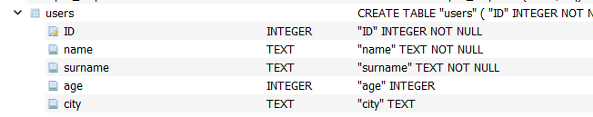
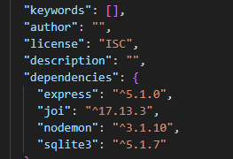

# Урок 4. Создание REST API с Express #

Для того, чтобы пользователи хранились постоянно, а не только, когда запущен сервер, необходимо реализовать хранение массива в файле.

## Work ##

За основу взят проект с семинара.

1. Добавлена база user.db

2. Подключена библиотека sqlite3.

